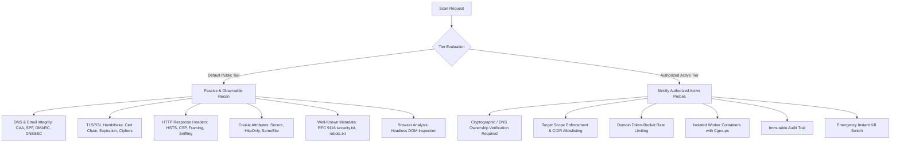

# EXPOSE: Authorization and Safety Model

> **Core Axiom**: *Expose is designed exclusively for authorized, responsible website security assessment.*  
> **Operational Guarantee**: *Default public scanning emphasizes safe, non-destructive, and externally observable checks.*

---

## 1. Public Communication & Terms of Assessment

Every interaction point in EXPOSE (CLI, Web UI, API, and Documentation) prominently presents the following binding principle:

```
+-----------------------------------------------------------------------------+
|                             AUTHORIZATION NOTICE                            |
|                                                                             |
| Only scan websites you own or are explicitly authorized to test.            |
| Unauthorized scanning of third-party systems may violate computer misuse   |
| legislation (such as CFAA, CMA, or local cybercrime statutes).              |
+-----------------------------------------------------------------------------+
```

### Acceptable Use Policy
- Users must possess explicit authorization (ownership, written bug bounty scope, or customer agreement) before initiating scans against any domain or IP address.
- EXPOSE must not be utilized for harassment, unauthorized reconnaissance against critical national infrastructure, or gathering intelligence to facilitate attacks.

---

## 2. Non-Destructive External Observation vs. Active Testing

EXPOSE strictly demarcates its scanning tiers to prevent unintended side effects on production systems.



### Prohibited Autonomous Exploitation
EXPOSE does **NOT**:
1. Perform autonomous post-exploitation or lateral movement.
2. Execute aggressive Denial of Service (DoS) stress tests or bandwidth saturation.
3. Inject destructive or modifying payloads (`DROP TABLE`, file deletion, credential brute-forcing, data exfiltration).
4. Probe internal networks via SSRF redirection.

---

## 3. SSRF & Network Scope Guardrails

To ensure EXPOSE cannot be abused as an open proxy or used to attack internal cloud resources, all inbound targets must pass through the **Pre-Flight Scope Guard**:

1. **DNS Pre-Flight Resolution**: Hostnames are resolved to both IPv4 and IPv6 addresses prior to socket generation.
2. **Restricted Subnet Blocklist**: Any target resolving to the following ranges is blocked by default:
   - `127.0.0.0/8` (IPv4 Loopback)
   - `::1/128` (IPv6 Loopback)
   - `10.0.0.0/8` (RFC 1918 Private Class A)
   - `172.16.0.0/12` (RFC 1918 Private Class B)
   - `192.168.0.0/16` (RFC 1918 Private Class C)
   - `169.254.0.0/16` (IPv4 Link-Local / Cloud Metadata e.g. AWS/GCP `169.254.169.254`)
   - `fe80::/10` (IPv6 Link-Local)
   - `fc00::/7` (IPv6 Unique Local Address)
   - `0.0.0.0/8` (Current Network)
   - `224.0.0.0/4` (Multicast)
3. **Internal Testing Opt-In**: Scanning private or loopback networks requires explicit multi-factor administrative opt-in (`--allow-private` CLI flag or authenticated staging mode).

---

## 4. Active Testing Authorization Protocols

When active or template-driven probing (e.g. Nuclei components) is triggered, the following safeguards are enforced:

### A. Domain Ownership Verification
Before initiating any active probe, the operator must prove domain control via one of two challenges:
- **DNS TXT Record Challenge**: Publish a unique cryptographic token at `_expose-challenge.<domain>`.
- **HTTP Well-Known Token**: Serve a temporary token at `https://<domain>/.well-known/expose-verify.txt`.

### B. Concurrency & Rate Limiting Controls
- Default rate limit: Maximum **5 requests per second** per target domain.
- Global worker concurrency cap: Maximum **10 concurrent target hosts** across the cluster.
- Backoff behavior: If target returns HTTP 429 (Too Many Requests) or HTTP 503 (Service Unavailable), probing immediately pauses with exponential backoff.

### C. Worker Isolation & Resource Limits
- Background scanning tasks execute inside isolated Docker containers or ephemeral unprivileged processes.
- Memory limit: 512 MB per worker.
- CPU quota: 0.5 CPU cores per worker.
- Strict network timeout: 15 seconds per network request; 120 seconds maximum per scan session.

### D. Emergency Cancellation (Kill Switch)
- Every scan registers a cancellation channel in the backend orchestrator.
- An emergency abort trigger is available via:
  - Web UI: **Cancel Scan** button.
  - REST API: `POST /api/v1/scans/{id}/cancel`.
  - Signal interrupt: Instant context cancellation aborting all active sockets immediately.

### E. Immutable Audit Logging
- Every outbound request, probe start/finish event, error, and cancellation is recorded in an append-only audit log with microsecond timestamps and target IP attribution.
